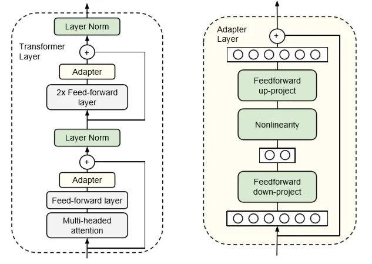

# Toxic_Comment_Classification

Social media and online portals are becoming raging platforms for expressing hatred and biases towards certain communities. **Cyber Bullying** has become a serious worldwide issue and needs to be countered. Our goal is to -
> identify hateful and abusive content with high accuracy so that one could safely use these platforms to express their opinion without being disrespectful.

To address these needs, in this study we investigate the ability of **BERT(Bidirectional Encoder Representations from Transformers)**, a pre-trained state-of the art NLP model, at capturing hateful context within social media content by using new finetuning methods based on transfer learning.

## Data Sets
We used publically available kaggle data set

> kaggle competitions download -c jigsaw-unintended-bias-in-toxicity-classification

## What is BERT?
BERT, which stands for Bidirectional Encoder Representations from Transformers, is a natural language processing (NLP) model developed by Google AI in 2018. It represents a significant advancement in the field of NLP and has had a profound impact on various NLP tasks. Key features and concepts are:

&ensp;&ensp;**Transformer Architecture:** BERT is built on the Transformer architecture, which is a neural network architecture introduced in the paper "Attention Is All You Need" by Vaswani et al. Transformers are known for their ability to capture long-range dependencies in sequences, making them well-suited for NLP tasks.

&ensp;&ensp;**Bidirectional Context:** Unlike previous NLP models that processed text in a left-to-right or right-to-left manner, BERT is designed to consider the context from both directions simultaneously. This bidirectional context modeling allows it to capture more nuanced and context-aware representations of words.

&ensp;&ensp;**Masked Language Modeling:** During pretraining, BERT uses a technique called masked language modeling (MLM). It randomly masks some of the words in a sentence and then learns to predict the masked words based on the surrounding context. This helps BERT understand the relationships between words and their context.

* General purpose Bidirectional Contextual language model
* A Transformer Encoder stack trained on Wikipedia and Book Corpus
* Performs better than deep learning models when finetuned for classification task

&ensp;&ensp;**Novel processing ideas of BERT**
*   Way to “fill in the blank” based on context. e.g: *“She bought a _____ of shoes.”* &rarr; *pair*. While current state-of-the-art OpenAI GPT represent *pair* based on *"she bought a"* but not on *"of shoes"*, BERT uses both previous and next context at the same time. 

*   Unique input token embedding 

*   Train Strategy: Masked LM -Randomly replace 15% of the words with a [MASK] token and try to predict them.

## Experiments (Fine Tuning BERT)

&ensp;&ensp;**Adapter Module Transfer Learning**
* Add a new modules
* Freeze original params and Train only new ones 
  $` \begin{multline}
Adapter(h_{j}) = W^{D}(non-linearity(W^{E}h_{j}) + b_{E}) + b_{D}\\
W^{E}: projects\ the\ input\ to\ a\ smaller\ space\\
W^{D}: projects\ the\ input\ to\ the\ original\ size\\
b: are\ biases
\end{multline}
 `$

&ensp;&ensp;**DistilBERT – distil versioned BERT**

&ensp;&ensp;**Discriminative Fine Tuning**

&ensp;&ensp;**BERT with LSTM**

## Experiment Result
Comparative study of different fine-tuned BERT Models:

| Models                                                          | # of Parameters   | Accuracy %  |
| --------------------------------------------------------------- | -----------------:| -----------:|
| DistilBert + Adaptive Model + Discriminative Learning Rate      |   1,783,298       | 91.77       |
| DistilBert + Gradual Freezing + Discriminative Learning Rate    |   7,680,002       |   87        |
| BERT with Adapter                                               |   3,009,794       |   90        |
| BERT Baseline (bert-base-uncased)                               | 109,483,778       |   91        |

Output Analysis:
* BERT baseline (12 layer) - very high accuracy but computationally expensive.
* DistilBERT (5 layers) + Discriminative Learning rate + Adaptive model - gives same accuracy but is much light weight, faster and has least number of trainable parameters
